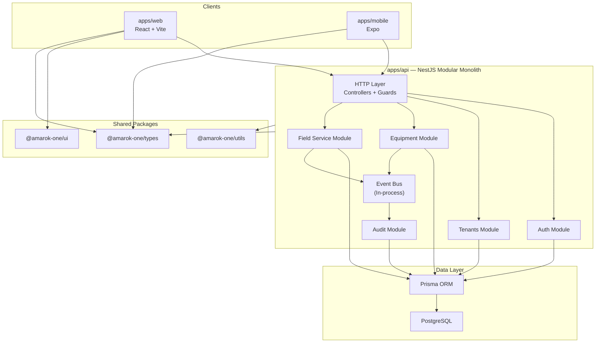

# AMAROK ONE — System Architecture

## Overview

AMAROK ONE is a multi-tenant ERP and field service management platform for construction equipment and forklift businesses. The system is built as a **modular monolith** — one deployable API with clearly bounded internal modules, shared infrastructure, and a strict separation between presentation and domain logic.

## Architecture principles

| Principle               | Description                                                               |
| ----------------------- | ------------------------------------------------------------------------- |
| API-first               | All clients (web, mobile, integrations) consume the same REST/GraphQL API |
| Modular monolith        | One NestJS application with feature modules, not premature microservices  |
| Multi-tenant by design  | Tenant context is enforced at every data access boundary                  |
| Event-driven internally | Modules emit and handle domain events to reduce tight coupling            |
| No business logic in UI | Web and mobile are thin clients — validation and rules live server-side   |
| Secure defaults         | Authentication, authorization, and input validation fail closed           |

## High-level diagram



## Monorepo layout

```
amarok-one/
├── apps/
│   ├── web/          React + TypeScript + Vite
│   ├── api/          NestJS modular monolith
│   └── mobile/       Expo React Native
├── packages/
│   ├── config/       Shared TS & ESLint presets
│   ├── types/        Domain types and DTOs (no runtime logic)
│   ├── utils/        Pure utilities safe for client and server
│   └── ui/           Presentational React components
├── infrastructure/   Docker, compose, deployment configs
└── docs/             Architecture, standards, security, workflow
```

Managed with **pnpm workspaces** and **Turborepo** for build orchestration and caching.

## API layer — NestJS modular monolith

The API (`apps/api`) is a single NestJS application organized into feature modules. Each module owns its controllers, services, DTOs, and Prisma queries for a bounded context.

### Module boundaries (planned)

| Module               | Responsibility                                  |
| -------------------- | ----------------------------------------------- |
| `AuthModule`         | Authentication, sessions/JWT, password policies |
| `TenantsModule`      | Tenant provisioning, tenant context resolution  |
| `UsersModule`        | User management scoped to tenant                |
| `EquipmentModule`    | Asset inventory, categories, serial numbers     |
| `FieldServiceModule` | Work orders, assignments, technician workflows  |
| `AuditModule`        | Immutable audit log writes and queries          |
| `HealthModule`       | Health checks and readiness probes              |

### Request lifecycle

1. **Ingress** — HTTP request hits NestJS controller
2. **Guards** — Authentication and tenant context established
3. **Validation** — DTO validated via `class-validator` / Zod (project standard TBD)
4. **Service** — Business logic executes in injectable services
5. **Persistence** — Prisma queries scoped by `tenantId`
6. **Events** — Domain events emitted for cross-module side effects (audit, notifications)
7. **Response** — Typed API envelope returned to client

## Data layer — PostgreSQL + Prisma

### Database conventions

| Rule             | Detail                                                                  |
| ---------------- | ----------------------------------------------------------------------- |
| Primary keys     | UUID (`uuid` type, generated server-side)                               |
| Tenant isolation | Every tenant-scoped table includes `tenantId`; all queries filter by it |
| Soft delete      | Use `deletedAt` timestamp where records must not be hard-deleted        |
| Audit trail      | Append-only `AuditLog` table; never update or delete audit rows         |
| Timestamps       | `createdAt`, `updatedAt` on all mutable entities                        |
| Migrations       | Prisma Migrate; never edit production schema by hand                    |

### Example entity shape

```prisma
model Equipment {
  id           String    @id @default(uuid()) @db.Uuid
  tenantId     String    @db.Uuid
  name         String
  category     String
  serialNumber String?
  createdAt    DateTime  @default(now())
  updatedAt    DateTime  @updatedAt
  deletedAt    DateTime?

  tenant Tenant @relation(fields: [tenantId], references: [id])

  @@index([tenantId])
  @@index([tenantId, deletedAt])
}
```

## Multi-tenancy

AMAROK ONE uses **shared database, shared schema** multi-tenancy with row-level isolation:

- Every tenant-scoped row carries a `tenantId` foreign key
- Tenant context is resolved from the authenticated session/JWT — never from unverified request body fields
- Prisma middleware or repository base classes enforce tenant filtering on all reads and writes
- Cross-tenant access is forbidden unless explicitly built for platform-admin operations with separate guards

## Event-driven internal architecture

Cross-module side effects use an in-process event bus (NestJS `EventEmitter2` or equivalent):

- **Commands** mutate state within a module's service layer
- **Events** notify other modules (e.g., `WorkOrderCompleted` triggers audit log + notification)
- Events are typed, documented, and handled idempotently where possible
- External message brokers (Redis, RabbitMQ) are deferred until scale requires them

## Web client — React + TypeScript + Vite

`apps/web` is a presentation layer:

- Fetches data from the API; no direct database access
- Uses `@amarok-one/ui` for shared components
- Uses `@amarok-one/types` for shared type definitions
- Contains routing, layout, forms, and display logic only
- Form validation mirrors API rules but authoritative validation is always server-side

## Mobile client — Expo React Native

`apps/mobile` follows the same rules as web: thin client, API-first, no embedded business rules.

## Shared packages

| Package              | Contains                     | Must not contain          |
| -------------------- | ---------------------------- | ------------------------- |
| `@amarok-one/types`  | Interfaces, enums, DTO types | Runtime logic, DB access  |
| `@amarok-one/utils`  | Pure functions               | NestJS deps, React deps   |
| `@amarok-one/ui`     | Presentational components    | API calls, business rules |
| `@amarok-one/config` | TS and ESLint presets        | Application code          |

## Legacy code

The directories `frontend/` and `backend/` predate the monorepo structure. They are **not part of the active architecture** and must not receive new features. Migration into `apps/` happens only when explicitly planned.

## Technology stack summary

| Layer      | Technology                  |
| ---------- | --------------------------- |
| Monorepo   | pnpm workspaces + Turborepo |
| Language   | TypeScript (strict)         |
| Web        | React + Vite                |
| API        | NestJS                      |
| ORM        | Prisma                      |
| Database   | PostgreSQL                  |
| Mobile     | Expo + React Native         |
| Linting    | ESLint (flat config)        |
| Formatting | Prettier                    |
| Containers | Docker + docker-compose     |

## Related documents

- [CODING_STANDARDS.md](CODING_STANDARDS.md) — Code conventions
- [SECURITY.md](SECURITY.md) — Security requirements
- [DEVELOPMENT_WORKFLOW.md](DEVELOPMENT_WORKFLOW.md) — Development process
- [MONOREPO.md](MONOREPO.md) — Workspace commands and package graph
