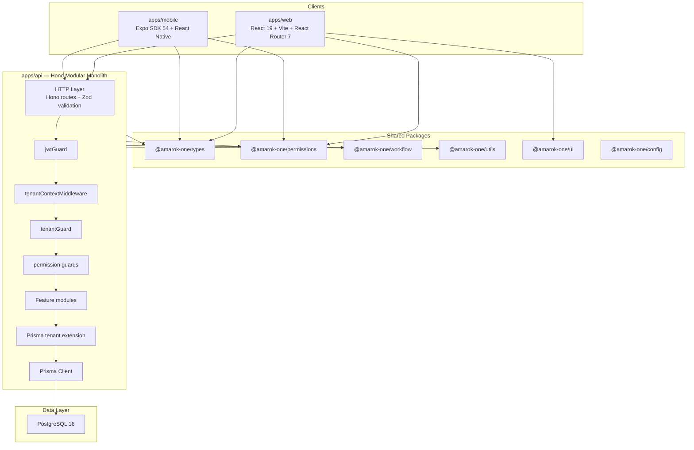

# AMAROK ONE — Baseline Architecture Reference

**Document type:** Authoritative architecture snapshot  
**Baseline date:** August 1, 2026  
**Scope:** Post A1 (tenant isolation + Platform Admin) and A2 (Prisma data-layer enforcement)  
**Status:** Reference architecture for all future development

This document describes the system **as implemented**, not as originally planned. Where older documents (e.g. `ARCHITECTURE.md`) conflict with this baseline, **this document takes precedence** until explicitly superseded.

---

## Table of contents

1. [System overview](#1-system-overview)
2. [Architecture principles](#2-architecture-principles)
3. [High-level system diagram](#3-high-level-system-diagram)
4. [Monorepo layout](#4-monorepo-layout)
5. [Technology stack](#5-technology-stack)
6. [API layer — Hono modular monolith](#6-api-layer--hono-modular-monolith)
7. [Request lifecycle](#7-request-lifecycle)
8. [Multi-tenancy model](#8-multi-tenancy-model)
9. [Platform administration](#9-platform-administration)
10. [Authentication](#10-authentication)
11. [Authorization and RBAC](#11-authorization-and-rbac)
12. [Data layer — PostgreSQL and Prisma](#12-data-layer--postgresql-and-prisma)
13. [Prisma tenant isolation extension (A2)](#13-prisma-tenant-isolation-extension-a2)
14. [Workflow and event sourcing](#14-workflow-and-event-sourcing)
15. [Audit trail](#15-audit-trail)
16. [Web client](#16-web-client)
17. [Mobile client](#17-mobile-client)
18. [Shared packages](#18-shared-packages)
19. [Build system and tooling](#19-build-system-and-tooling)
20. [Infrastructure and deployment](#20-infrastructure-and-deployment)
21. [Legacy directories](#21-legacy-directories)
22. [Testing posture](#22-testing-posture)
23. [Known gaps and deferred work](#23-known-gaps-and-deferred-work)
24. [Related documents](#24-related-documents)

---

## 1. System overview

AMAROK ONE is a **multi-tenant ERP and field service management platform** for construction equipment and forklift businesses. The system is built as a **modular monolith**: one deployable API with clearly bounded internal modules, shared infrastructure, and strict separation between presentation and domain logic.

| Attribute        | Value                                                                    |
| ---------------- | ------------------------------------------------------------------------ |
| Primary users    | Service managers, coordinators, technicians, warehouse staff, accounting |
| Tenant model     | Shared database, shared schema, row-level isolation by `organizationId`  |
| API style        | REST, JSON envelope (`ApiResponse<T>`)                                   |
| Client strategy  | API-first; web and mobile are thin clients                               |
| Current maturity | Late MVP — core ERP entities and service-call lifecycle operational      |

---

## 2. Architecture principles

| Principle                        | Implementation                                                                |
| -------------------------------- | ----------------------------------------------------------------------------- |
| **API-first**                    | All clients consume the same REST API; no direct database access from clients |
| **Modular monolith**             | Single Hono application with feature modules — not microservices              |
| **Multi-tenant by design**       | Tenant context enforced at route guards **and** Prisma data layer             |
| **Fail closed**                  | Missing auth, authorization, or tenant context denies access                  |
| **No business logic in UI**      | Validation and rules live server-side; clients mirror UX validation only      |
| **Defense in depth**             | Route guards + service-layer scoping + Prisma extension                       |
| **Explicit cross-tenant access** | Only `platform:admin` permission allows cross-tenant operations               |

---

## 3. High-level system diagram



---

## 4. Monorepo layout

Managed with **pnpm workspaces** and **Turborepo**.

```
amarok-one/
├── apps/
│   ├── api/          @amarok-one/api      — Hono REST API (modular monolith)
│   ├── web/          @amarok-one/web      — React + Vite web client
│   └── mobile/       @amarok-one/mobile   — Expo React Native (technician app)
├── packages/
│   ├── config/       @amarok-one/config   — Shared TS & ESLint presets
│   ├── types/        @amarok-one/types    — Domain types and DTOs
│   ├── utils/        @amarok-one/utils    — Pure API helpers
│   ├── ui/           @amarok-one/ui       — Web presentational components
│   ├── permissions/  @amarok-one/permissions — RBAC engine, roles, navigation
│   └── workflow/     @amarok-one/workflow — Event-sourced service-call lifecycle
├── infrastructure/                        — Docker & deployment configs
├── docs/                                  — Project documentation
├── frontend/                              — LEGACY (Vite template, not in workspace)
└── backend/                               — LEGACY (empty stub, not in workspace)
```

**Workspace scope:** Only `apps/*` and `packages/*` are pnpm workspace members. Legacy directories are excluded.

---

## 5. Technology stack

| Layer      | Technology                            | Version notes           |
| ---------- | ------------------------------------- | ----------------------- |
| Monorepo   | pnpm workspaces + Turborepo           | pnpm 10.x, Node ≥ 20    |
| Language   | TypeScript (strict)                   | ~6.0                    |
| API        | **Hono 4** + `@hono/node-server`      | Not NestJS              |
| Validation | Zod + `@hono/zod-validator`           |                         |
| ORM        | Prisma 6                              | PostgreSQL provider     |
| Database   | PostgreSQL 16                         |                         |
| Auth       | JWT (`jose`) + refresh token rotation | argon2 password hashing |
| Web        | React 19 + Vite 8 + React Router 7    |                         |
| Mobile     | Expo SDK 54 + React Native 0.81       |                         |
| Testing    | Vitest 3                              |                         |
| Containers | Docker + docker-compose               |                         |

> **Note:** Older documentation (`ARCHITECTURE.md`, `AGENTS.md`, `SECURITY.md`) still references NestJS. The running API is Hono throughout. Future doc updates should align with this baseline.

---

## 6. API layer — Hono modular monolith

**Entry point:** `apps/api/src/index.ts`  
**Composition root:** `apps/api/src/composition-root.ts` (manual dependency wiring)  
**Route assembly:** `apps/api/src/routes.ts`

### Module structure

Each feature lives under `apps/api/src/modules/<feature>/`:

| File pattern   | Responsibility                                       |
| -------------- | ---------------------------------------------------- |
| `*.routes.ts`  | Hono route definitions, validators, middleware chain |
| `*.service.ts` | Business logic and Prisma queries                    |
| `*.schemas.ts` | Zod request/response schemas                         |

### Feature modules

| Module            | Route prefix                                   | Tenant guard                 | Notes                                      |
| ----------------- | ---------------------------------------------- | ---------------------------- | ------------------------------------------ |
| **auth**          | `/auth`                                        | N/A (mixed public/protected) | Login, refresh, logout, `/me`, switch-role |
| **organizations** | `/organizations`                               | Custom access guards         | A1: strict tenant + platform admin         |
| **companies**     | `/organizations/:organizationId/companies`     | Yes                          |                                            |
| **branches**      | `.../companies/:companyId/branches`            | Yes                          |                                            |
| **customers**     | `/organizations/:organizationId/customers`     | Yes                          | CRUD + nested contacts                     |
| **equipment**     | `/organizations/:organizationId/equipment`     | Yes                          | Types + assets                             |
| **service-calls** | `/organizations/:organizationId/service-calls` | Yes                          | CRUD, lifecycle, visits                    |

### Cross-cutting libraries

| Path                                      | Purpose                                 |
| ----------------------------------------- | --------------------------------------- |
| `lib/prisma.ts`                           | Prisma singleton with tenant extension  |
| `lib/tenant-context.ts`                   | AsyncLocalStorage tenant scope          |
| `lib/tenant.ts`                           | Tenant access assertions                |
| `lib/jwt.ts`                              | JWT sign/verify                         |
| `lib/password.ts`                         | argon2 hashing                          |
| `lib/audit.ts`                            | Imperative audit log writes             |
| `lib/errors.ts`                           | Typed `AppError` hierarchy              |
| `middleware/jwt-guard.ts`                 | Bearer token authentication             |
| `middleware/tenant-context-middleware.ts` | Sets request tenant scope from JWT      |
| `middleware/tenant-guard.ts`              | URL `:organizationId` vs JWT validation |
| `middleware/permission-guard.ts`          | RBAC permission checks                  |
| `middleware/platform-admin-guard.ts`      | Cross-tenant authorization              |
| `middleware/organization-access-guard.ts` | Org read/write access rules             |
| `middleware/rate-limit.ts`                | In-memory auth rate limiting            |

### Public endpoints

| Method | Path            | Description                   |
| ------ | --------------- | ----------------------------- |
| `GET`  | `/`             | API metadata                  |
| `GET`  | `/health`       | Liveness + DB connectivity    |
| `GET`  | `/health/db`    | DB diagnostics (prod-guarded) |
| `POST` | `/auth/login`   | Authenticate                  |
| `POST` | `/auth/refresh` | Rotate refresh token          |

All other routes require JWT authentication.

---

## 7. Request lifecycle

### Protected route flow

```
1. HTTP request
2. secureHeaders + logger + CORS          (global, index.ts)
3. jwtGuard                               (Bearer token → auth context)
4. tenantContextMiddleware                (AsyncLocalStorage organizationId from JWT)
5. Feature middleware chain:
   a. tenantGuard                         (URL org vs JWT org, platform admin override)
   b. permission guards                   (RBAC slug checks)
   c. organization access guards          (org-specific read/write rules)
6. Zod validation                         (@hono/zod-validator)
7. Service layer                          (business logic)
8. Prisma tenant extension                (automatic organizationId scoping)
9. ApiResponse envelope                   (createApiResponse)
```

### Auth route flow

| Route                    | Middleware               | Tenant context                         |
| ------------------------ | ------------------------ | -------------------------------------- |
| `POST /auth/login`       | Rate limit               | `runWithoutTenantIsolation` in service |
| `POST /auth/refresh`     | Rate limit               | `runWithoutTenantIsolation` in service |
| `POST /auth/logout`      | jwtGuard + tenantContext | JWT org scope                          |
| `GET /auth/me`           | jwtGuard + tenantContext | JWT org scope                          |
| `POST /auth/switch-role` | jwtGuard + tenantContext | JWT org scope                          |

---

## 8. Multi-tenancy model

### Tenant boundary

**Organization = tenant.** All tenant-isolated data references `Organization.id` via `organizationId`.

| Concept      | Field / entity                                     |
| ------------ | -------------------------------------------------- |
| Tenant root  | `Organization`                                     |
| Tenant FK    | `organizationId` on all tenant-scoped tables       |
| Auth context | JWT embeds `organizationId` from active membership |
| URL pattern  | `/organizations/:organizationId/...`               |

### Isolation layers (defense in depth)

| Layer                   | Mechanism                                         | File(s)                                   |
| ----------------------- | ------------------------------------------------- | ----------------------------------------- |
| **1. JWT**              | `organizationId` baked into access token at login | `lib/jwt.ts`, `auth.service.ts`           |
| **2. Route guard**      | `tenantGuard` compares URL param to JWT org       | `middleware/tenant-guard.ts`              |
| **3. Access guards**    | Organization-specific read/write rules            | `middleware/organization-access-guard.ts` |
| **4. Service layer**    | Queries include `organizationId` + `activeOnly`   | `*.service.ts`                            |
| **5. Prisma extension** | Automatic `organizationId` injection/filter       | `lib/prisma-tenant-extension.ts`          |

### Tenant-scoped Prisma models

Models automatically scoped by the Prisma extension:

- `Company`, `Branch`, `Customer`, `CustomerContact`
- `EquipmentType`, `Equipment`
- `ServiceCall`, `ServiceCallVisit`
- `WorkflowEvent`, `UserRole`, `Role`, `AuditLog`

`Organization` is scoped by `id` (not `organizationId`).

### Global Prisma models (not tenant-scoped)

- `User`, `Permission`, `RolePermission`, `RefreshToken`

### Database conventions

| Rule            | Detail                                       |
| --------------- | -------------------------------------------- |
| Primary keys    | UUID (`@default(uuid())`)                    |
| Soft delete     | `deletedAt DateTime?` on mutable entities    |
| Timestamps      | `createdAt`, `updatedAt` on mutable entities |
| Audit           | Append-only `AuditLog` (no update/delete)    |
| Workflow events | Append-only `WorkflowEvent`                  |
| Migrations      | Prisma Migrate only                          |

---

## 9. Platform administration

Introduced in **A1**. Cross-tenant operations require explicit authorization.

### Permission

| Slug             | Name                   | Purpose                          |
| ---------------- | ---------------------- | -------------------------------- |
| `platform:admin` | Platform Administrator | Cross-tenant platform operations |

### Role

| Slug             | Name           | Permissions           |
| ---------------- | -------------- | --------------------- |
| `platform-admin` | Platform Admin | `platform:admin` only |

Tenant roles (`system-administrator`, `company-owner`, etc.) receive **`TENANT_PERMISSION_SLUGS`** — all permissions **except** `platform:admin`. Full org access within a tenant does **not** grant cross-tenant access.

### Cross-tenant operation matrix

| Operation                                 | Tenant user                        | Platform Admin                          |
| ----------------------------------------- | ---------------------------------- | --------------------------------------- |
| `GET /organizations`                      | Own org only                       | All organizations                       |
| `POST /organizations`                     | **403 Forbidden**                  | Allowed                                 |
| `GET /organizations/:id` (own)            | Allowed with `organizations:read`  | Allowed                                 |
| `GET /organizations/:id` (other)          | **403 Forbidden**                  | Allowed                                 |
| `PATCH/DELETE /organizations/:id` (own)   | Allowed with `organizations:write` | Allowed                                 |
| `PATCH/DELETE /organizations/:id` (other) | **403 Forbidden**                  | Allowed                                 |
| Nested routes under other org             | **403 Forbidden**                  | Allowed; context switched to target org |

### Platform admin context switching

When a platform admin accesses another tenant:

1. `assertTenantOrganizationAccess()` verifies `platform:admin`
2. `setRequestTenantOrganizationId(targetOrgId)` updates AsyncLocalStorage
3. Prisma extension scopes all subsequent queries to the target organization

Global listing/creation uses `runWithBypassTenantIsolation()` to temporarily disable Prisma scoping.

---

## 10. Authentication

### Token model

| Token         | Storage (web)           | Storage (mobile)    | TTL default |
| ------------- | ----------------------- | ------------------- | ----------- |
| Access token  | In-memory (React state) | In-memory           | 15 minutes  |
| Refresh token | `sessionStorage`        | `expo-secure-store` | 7 days      |

### JWT access token payload

```typescript
{
  sub: string;              // user ID
  email: string;
  organizationId: string;
  organizationSlug: string;
  roleId: string;
  roleSlug: string;
  roles: AuthRole[];
  permissions: string[];    // active role permission slugs
  type: "access";
}
```

### Auth flows

| Flow            | Behavior                                                                                |
| --------------- | --------------------------------------------------------------------------------------- |
| **Login**       | Email/password → resolve org (slug or first membership) → issue access + refresh tokens |
| **Refresh**     | Verify refresh token hash → rotate (revoke old, create new) → reissue access token      |
| **Logout**      | Revoke refresh token(s)                                                                 |
| **Switch role** | Reissue access token with different active role (same org)                              |
| **Multi-role**  | User may hold multiple `UserRole` rows per org; JWT reflects active role permissions    |

### Security controls

- Passwords hashed with **argon2id**
- Refresh tokens stored hashed (argon2) in `RefreshToken` table
- Auth routes rate-limited: 10 requests/minute/IP (in-memory)
- `/health/db` protected in production via `X-Health-Token` header

---

## 11. Authorization and RBAC

### Package

`@amarok-one/permissions` is the single source of truth for:

- 37 permission slugs (including `platform:admin`)
- 11 default roles (including `platform-admin`)
- Permission evaluation engine
- Navigation items and route access rules
- Role landing paths and dashboards

### Default roles

| Role slug              | Scope        | Key permissions                           |
| ---------------------- | ------------ | ----------------------------------------- |
| `platform-admin`       | Cross-tenant | `platform:admin`                          |
| `system-administrator` | Tenant       | All tenant permissions                    |
| `company-owner`        | Tenant       | All tenant permissions                    |
| `service-manager`      | Tenant       | Service operations, assign, close         |
| `service-coordinator`  | Tenant       | Schedule and coordinate                   |
| `technician`           | Tenant       | Assigned work only (`my_service_calls:*`) |
| `parts-manager`        | Tenant       | Inventory, parts, POs                     |
| `warehouse-employee`   | Tenant       | Warehouse operations                      |
| `accounting`           | Tenant       | Financial modules                         |
| `read-only`            | Tenant       | View-only across modules                  |

Roles are tenant-scoped (`Role.organizationId`) and seeded per organization. Permission assignments are configurable via `RolePermission` in the database.

### Technician scoping

Technicians with `my_service_calls:read` but **without** `service_calls:read` are restricted to assigned service calls only (`isAssignedServiceCallsOnly()`).

### Web RBAC integration

- Route guards: `ProtectedRoute`, `PermissionRoute`
- Navigation: `buildNavigationItems()` filters sidebar by permissions
- Landing paths: role-specific dashboards via `getDefaultLandingPath()`

### Mobile RBAC integration

- Login gate: rejects non-technician users via `isAssignedServiceCallsOnly()`
- No full RBAC navigation (technician MVP scope)

---

## 12. Data layer — PostgreSQL and Prisma

**Schema:** `apps/api/prisma/schema.prisma`  
**Client:** `apps/api/src/lib/prisma.ts`  
**Migrations:** `apps/api/prisma/migrations/`

### Entity model (17 models)

| Model              | Scope             | Soft delete      |
| ------------------ | ----------------- | ---------------- |
| `Organization`     | Tenant root       | Yes              |
| `Company`          | Tenant            | Yes              |
| `Branch`           | Tenant            | Yes              |
| `User`             | Global identity   | Yes              |
| `Permission`       | Global catalog    | No               |
| `Role`             | Tenant            | Yes              |
| `RolePermission`   | Join              | No               |
| `UserRole`         | Tenant membership | Yes              |
| `RefreshToken`     | Per user          | No (revoked)     |
| `AuditLog`         | Tenant            | No (append-only) |
| `Customer`         | Tenant            | Yes              |
| `CustomerContact`  | Tenant            | Yes              |
| `EquipmentType`    | Tenant            | Yes              |
| `Equipment`        | Tenant            | Yes              |
| `ServiceCall`      | Tenant            | Yes              |
| `ServiceCallVisit` | Tenant            | Yes              |
| `WorkflowEvent`    | Tenant            | No (append-only) |

### Key enums

- `CustomerStatus`, `EquipmentStatus`
- `ServiceCallStatus`, `ServiceCallPriority`, `ServiceCallLifecycleState`
- `ServiceCallVisitStatus`

> **Known dual-status:** `ServiceCall` carries both legacy `status` and workflow-driven `lifecycleState`. Workflow projection is the source of truth for lifecycle transitions. Consolidation is deferred.

---

## 13. Prisma tenant isolation extension (A2)

**File:** `apps/api/src/lib/prisma-tenant-extension.ts`  
**Context:** `apps/api/src/lib/tenant-context.ts` (AsyncLocalStorage)

### How it works

The Prisma Client extension intercepts all operations on tenant-scoped models via `$allModels.$allOperations`:

| Condition                          | Behavior                                                |
| ---------------------------------- | ------------------------------------------------------- |
| `bypassTenantIsolation = true`     | Pass through unchanged                                  |
| Global model                       | Pass through unchanged                                  |
| Tenant-scoped model + context set  | Merge `organizationId` into `where`; inject on `create` |
| `Organization` model + context set | Scope by `id = organizationId`                          |
| Tenant-scoped model + no context   | Throw `TENANT_CONTEXT_REQUIRED` (fail closed)           |

### Context modes

| Function                                   | Use case                                                    |
| ------------------------------------------ | ----------------------------------------------------------- |
| `runWithTenantContext({ organizationId })` | Default authenticated request scope                         |
| `runWithoutTenantIsolation()`              | Auth login/refresh, health diagnostics, maintenance scripts |
| `runWithBypassTenantIsolation()`           | Platform admin global org listing/creation                  |
| `setRequestTenantOrganizationId(id)`       | Platform admin accessing a specific other tenant            |

### Trusted bypass call sites

| Location                                      | Reason                               |
| --------------------------------------------- | ------------------------------------ |
| `auth.service.ts` — login, refresh            | Pre-auth cross-org membership lookup |
| `index.ts` — `/health/db`                     | Unauthenticated aggregate counts     |
| `reconcile-service-call-workflows.ts`         | Cross-tenant batch maintenance       |
| `organization.routes.ts` — platform admin ops | Global org management                |

Seed script (`prisma/seed.ts`) uses its own raw `PrismaClient` instance, outside the extension.

Unique update, delete, and upsert selectors retain their unique key and also include the active
`organizationId`. This prevents a leaked record ID from bypassing tenant isolation at the data layer.

---

## 14. Workflow and event sourcing

**Package:** `@amarok-one/workflow`  
**Integration:** `apps/api/src/infrastructure/workflow/prisma-workflow-event-store.ts`

Service-call lifecycle uses **event sourcing** within a bounded context:

```
Service call mutation
  → ServiceCallWorkflowIntegration (ACL)
    → WorkflowModule.dispatch(command)
      → WorkflowEngine
        → append WorkflowEvent rows (Prisma)
          → project to ServiceCall / ServiceCallVisit operational tables
```

### Lifecycle states

`ServiceCallLifecycleState`: NEW → WAITING_ASSIGNMENT → ASSIGNED → DRIVING → WORKING → ... → CLOSED

### Visit workflow

Technician visit transitions: `POST .../visits/:id/driving`, `/working`, `/finish`

### Reconciliation

`scripts/reconcile-service-call-workflows.ts` replays/repairs workflow projection drift.

> There is **no general in-process event bus**. Cross-module side effects use imperative calls (e.g. `writeAuditLog()`). An event bus is deferred.

---

## 15. Audit trail

**Model:** `AuditLog` (append-only, tenant-scoped)

### Current coverage

| Module                      | Audited |
| --------------------------- | ------- |
| Customers (+ contacts)      | Yes     |
| Equipment                   | Yes     |
| Service calls (+ lifecycle) | Yes     |
| Organizations               | **No**  |
| Companies, branches         | **No**  |
| Auth events                 | **No**  |
| RBAC changes                | **No**  |

Audit expansion is deferred (A4).

---

## 16. Web client

**App:** `apps/web` (`@amarok-one/web`)  
**Stack:** React 19 + Vite 8 + React Router 7

### Architecture

| Concern | Implementation                                               |
| ------- | ------------------------------------------------------------ |
| Routing | Nested routes with auth/RBAC guards                          |
| Auth    | `AuthProvider` context; refresh in `sessionStorage`          |
| API     | Domain modules in `src/lib/*-api.ts` wrapping `apiRequest()` |
| State   | Local `useState` + `useEffect` per page (no global cache)    |
| i18n    | English + Hebrew (`I18nProvider`)                            |
| Design  | `@amarok-one/ui` + CSS design tokens                         |
| RBAC    | `@amarok-one/permissions` for routes, nav, landing           |

### Implemented features

- Login / logout / role switching
- Role dashboards (6 variants; service manager has real data)
- Customers CRUD
- Equipment CRUD
- Service calls CRUD + lifecycle panel
- My service calls (technician view)

### Placeholder routes

Inventory, purchase orders, parts, accounting, reports, calendar, technicians, my equipment, my schedule — render `ModulePlaceholderPage`.

### Known web limitations

- Client-side domain logic in `src/lib/` (dashboard bucketing, lifecycle filtering)
- No 401 auto-refresh interceptor
- Refresh token in `sessionStorage` (XSS exposure risk)
- `OrganizationSwitcher` is display-only (no multi-org switching)
- No React Query or global data cache

---

## 17. Mobile client

**App:** `apps/mobile` (`@amarok-one/mobile`)  
**Stack:** Expo SDK 54 + React Native 0.81 + React Navigation 7

### Scope

Technician field app only — 4 screens:

| Screen      | Purpose                                        |
| ----------- | ---------------------------------------------- |
| Login       | Email/password + optional org slug             |
| Home        | Work day, assigned service calls               |
| CurrentTask | Active visit discovery                         |
| Visit       | Driving/working/finish workflow, notes, photos |

### Architecture

| Concern    | Implementation                                          |
| ---------- | ------------------------------------------------------- |
| Auth       | `AuthContext`; refresh in `expo-secure-store`           |
| API        | Fetch client in `src/api/client.ts`                     |
| RBAC       | Technician gate at login only                           |
| Local data | Work day, photos, timeline in AsyncStorage (not synced) |
| Build      | EAS Build configured (dev/preview/production)           |

### Shared packages used

- `@amarok-one/types` — domain and API types
- `@amarok-one/permissions` — `isAssignedServiceCallsOnly` only

---

## 18. Shared packages

### Dependency graph

```
@amarok-one/config (dev tooling)
@amarok-one/types (leaf types)
  ├── @amarok-one/utils
  ├── @amarok-one/ui
  ├── @amarok-one/permissions
  └── @amarok-one/workflow

@amarok-one/utils    → api, web*, mobile*
@amarok-one/ui       → web
@amarok-one/permissions → api, web, mobile
@amarok-one/workflow → api

* declared but unused in web/mobile at baseline date
```

### Package summary

| Package       | Runtime logic                       | Consumers                           |
| ------------- | ----------------------------------- | ----------------------------------- |
| `types`       | None (types only)                   | All apps                            |
| `utils`       | `createApiResponse`, health helpers | API (web/mobile declare but unused) |
| `ui`          | Presentational React + CSS          | Web only                            |
| `permissions` | RBAC engine, nav, routes            | API, web, mobile                    |
| `workflow`    | Event-sourced lifecycle domain      | API only                            |
| `config`      | TS + ESLint presets                 | All (dev)                           |

---

## 19. Build system and tooling

### Root scripts

| Script           | Purpose                                  |
| ---------------- | ---------------------------------------- |
| `pnpm build`     | Turbo build (packages first, then apps)  |
| `pnpm dev`       | Start all dev servers                    |
| `pnpm lint`      | ESLint across workspace                  |
| `pnpm typecheck` | TypeScript check                         |
| `pnpm test`      | Vitest across workspace                  |
| `pnpm verify`    | format + lint + typecheck + test + build |
| `pnpm db:*`      | Database setup, migrate, seed, studio    |

### Turbo pipeline

- `build` depends on `^build` (upstream packages build first)
- `typecheck` depends on upstream package builds and type checks
- `@amarok-one/mobile#build` produces no artifacts (typecheck-only)
- `dev` is uncached and persistent

### Environment

Root `.env.example` documents all variables. Copy to `.env` at repository root.

Key API variables: `DATABASE_URL`, `JWT_SECRET`, `JWT_REFRESH_SECRET`, `CORS_ORIGIN`  
Key web variable: `VITE_API_URL`  
Key mobile variable: `EXPO_PUBLIC_API_URL`

---

## 20. Infrastructure and deployment

**Location:** `infrastructure/docker/`

| File                          | Purpose                             |
| ----------------------------- | ----------------------------------- |
| `docker-compose.postgres.yml` | Local PostgreSQL 16                 |
| `docker-compose.yml`          | Full stack (postgres + api + web)   |
| `Dockerfile.api`              | API image; runs migrations on start |
| `Dockerfile.web`              | Vite build + nginx                  |
| `entrypoint.api.sh`           | Migrate then start API              |
| `nginx.web.conf`              | SPA routing + `/health`             |

### Local development ports

| Service           | URL                                          |
| ----------------- | -------------------------------------------- |
| Web (dev)         | http://localhost:5173                        |
| API               | http://localhost:3000                        |
| PostgreSQL (host) | localhost:5433 (default via `POSTGRES_PORT`) |
| Web (Docker)      | http://localhost:8080                        |

See `docs/DEPLOYMENT.md` for production/AWS procedures.

---

## 21. Legacy directories

| Directory   | Status                                            | Action                  |
| ----------- | ------------------------------------------------- | ----------------------- |
| `frontend/` | Vite counter demo, npm lockfile, not in workspace | Do not modify or extend |
| `backend/`  | Empty README stub                                 | Do not modify or extend |

All new development belongs under `apps/` and `packages/`.

---

## 22. Testing posture

**Runner:** Vitest 3 (Node environment)

| Area                    | Test files               | Coverage level |
| ----------------------- | ------------------------ | -------------- |
| API middleware          | jwt-guard, rate-limit    | Unit           |
| API service-call domain | 15+ files                | Strong         |
| API other modules       | Schema/filter tests      | Partial        |
| API tenant              | `tenant.test.ts` (unit)  | Minimal        |
| Permissions package     | 3 files, 32 tests        | Strong         |
| Workflow package        | 2 files                  | Good           |
| Web                     | 9 files (pure functions) | Partial        |
| Mobile                  | 2 files                  | Minimal        |

### Not covered (deferred)

- Cross-tenant integration tests (A3)
- HTTP end-to-end API tests
- Component / UI tests
- Database integration tests

---

## 23. Known gaps and deferred work

The following were identified in the architecture review and **intentionally not implemented** at this baseline:

| ID  | Item                                                   | Priority |
| --- | ------------------------------------------------------ | -------- |
| A3  | Cross-tenant integration tests                         | P0       |
| A4  | Audit logging expansion                                | P0       |
| A5  | Production rate limiting (Redis/edge)                  | P2       |
| A6  | httpOnly cookie refresh tokens                         | P2       |
| A7  | 401 auto-refresh in API clients                        | P2       |
| B1  | Documentation alignment (Hono vs NestJS in older docs) | P1       |
| C1  | Consolidate `ServiceCall.status` vs `lifecycleState`   | P2       |
| C2  | API lifecycle filter (remove web client workaround)    | P2       |
| D1  | Move web domain logic to API/shared package            | P2       |
| D2  | Data-fetching layer on web (TanStack Query)            | P2       |
| E1  | Mobile field data sync to API                          | P2       |
| F1  | HTTP/API integration test foundation                   | P1       |

### Baseline health scores (August 1, 2026)

| Dimension             | Score    |
| --------------------- | -------- |
| Architecture health   | 72 / 100 |
| Production readiness  | 48 / 100 |
| Scalability readiness | 55 / 100 |

---

## 24. Related documents

| Document                                   | Relationship to this baseline                                  |
| ------------------------------------------ | -------------------------------------------------------------- |
| **This document**                          | **Authoritative reference architecture**                       |
| [ARCHITECTURE.md](ARCHITECTURE.md)         | Original design intent (partially outdated — describes NestJS) |
| [SECURITY.md](SECURITY.md)                 | Security requirements (partially outdated stack references)    |
| [CODING_STANDARDS.md](CODING_STANDARDS.md) | Code conventions (references NestJS for API)                   |
| [MONOREPO.md](MONOREPO.md)                 | Workspace commands (missing permissions/workflow in diagram)   |
| [DEPLOYMENT.md](DEPLOYMENT.md)             | Production deployment                                          |
| [DESIGN_SYSTEM.md](DESIGN_SYSTEM.md)       | UI tokens and components                                       |
| [AGENTS.md](../AGENTS.md)                  | Agent instructions (requires doc reading before changes)       |

When implementing changes, update this baseline document in the same PR if architecture, tenancy, or security posture changes.

---

_End of baseline architecture reference._
