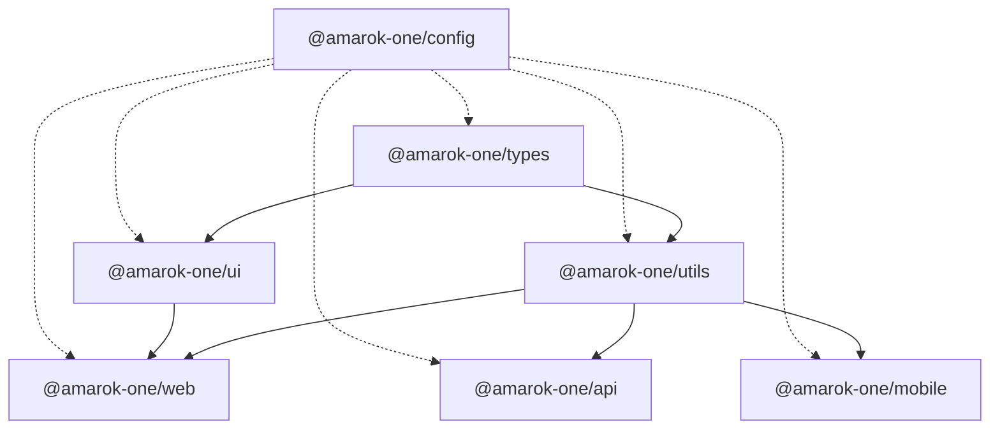

# Monorepo Guide

This document describes the AMAROK ONE monorepo layout, package boundaries, and development workflow.

## Workspace layout

```
amarok-one/
├── apps/
│   ├── web/          @amarok-one/web      — React + Vite web client
│   ├── api/          @amarok-one/api      — Hono REST API
│   └── mobile/       @amarok-one/mobile   — Expo React Native app
├── packages/
│   ├── config/       @amarok-one/config   — Shared TS & ESLint presets
│   ├── types/        @amarok-one/types    — Shared TypeScript types
│   ├── utils/        @amarok-one/utils    — Shared utility functions
│   └── ui/           @amarok-one/ui       — Shared React component library
├── infrastructure/                        — Docker & deployment configs
└── docs/                                  — Project documentation
```

## Package dependency graph



## Development commands

```bash
# Install all dependencies
pnpm install

# Build entire workspace (packages first, then apps)
pnpm build

# Start all dev servers
pnpm dev

# Lint and type-check
pnpm lint
pnpm typecheck

# Format code
pnpm format
```

## Running individual apps

```bash
# Web client (http://localhost:5173)
pnpm --filter @amarok-one/web dev

# API server (http://localhost:3000)
pnpm --filter @amarok-one/api dev

# Mobile app (Expo dev server)
pnpm --filter @amarok-one/mobile dev
```

## Conventions

| Rule        | Detail                                                       |
| ----------- | ------------------------------------------------------------ |
| Scope       | All internal packages use `@amarok-one/*`                    |
| Imports     | Apps import packages via workspace protocol (`workspace:*`)  |
| Build order | Turborepo runs `^build` — packages build before apps         |
| Config      | Extend presets from `@amarok-one/config`                     |
| Legacy code | `frontend/` and `backend/` are not part of the workspace yet |

## Adding a new package

1. Create a directory under `apps/` or `packages/`
2. Add a `package.json` with `build`, `dev`, `lint`, and `typecheck` scripts
3. Extend shared configs from `@amarok-one/config`
4. Run `pnpm install` from the root to link the workspace

## Environment variables

Copy `.env.example` to `.env` at the repository root. See individual app READMEs for app-specific variables.
